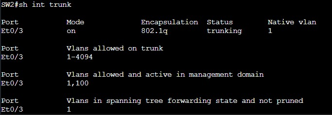
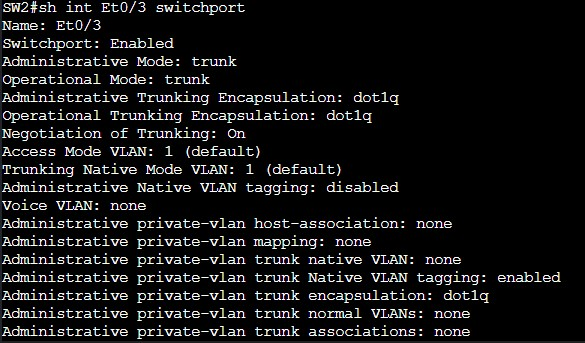

= Dynamic Trunking Protocol

DTP is a Cisco proprietary protocol designed to negotiate the trunking encapsulation and mode of operation between switches. This can allow switches to negotitate the encapsulatino
as either IEEE 802.1q or ISL (Inter-Switch Link). It also allows switches to negotiate trunking mode or access mode allowing the link to carry traffic from multiple VLANs.
DTP is enabled by default on switches running IOS such as 3650s and 3850s. On devices such as Nexus switches running NX-OS, DTP is not an option at all. It is general practice
to disable DTP as it can be seen as a security risk. Take great care when designing and configuring DTP in your network.

== Switchport Operation Modes

A switchport operating as a trunk is designed to carry traffic from multiple VLANs. These can be configured between switches and also routers where traffic from multiple VLANs and locations will traverse.
A switchport operating in access mode is designed to carry traffic from only one VLAN. These are designed to be configured on switchports connected to end hosts such as PCs, printers, and access points.
A switchport will always send DTP packets even while being in access mode unless the command *`SW(config)#switchport nonegotiate`* is configured.

In order for trunking to be established both sides of the link must agree to form a trunk. If both interfaces are configured with dynamic auto they will not form a trunk. This is because both sides are
waiting for each other to send a message that they want to form a trunk. The link would function as an access link, only allowing traffic from one VLAN to flow over it. A trunk will be formed if one side
of the link is configured with dyanmic desirable and the other side is configured with dyanmic desirable, dynamic auto, or statically set as a trunk. Below you can find a compatability matrix.

[cols="1,1,1,1,1"]
|===

|
|Dyanimc Auto
|Dyanimc Desirable
|Trunk
|Access

|Dynamic Auto
|Access
|Trunk
|Trunk
|Access

|Dynamic Desirable
|Trunk
|Trunk
|Trunk
|Access

|Trunk
|Trunk
|Trunk
|Trunk
|Limited Connection

|Access
|Access
|Access
|Limited Connection
|Access

|===

[cols="2,1,1"]
|===
|Mode
|Command
|Description

|Static Trunk
|*`SW(config)#switchport mode trunk`*
|This does not envoke any DTP negotation. The switchport will always operate as a trunk. However, despite this it will still send out DTP packets.

|Dynamic Auto
|*`SW(config)#switchport mode dynamic auto`*
|This is one of DTP's operating modes. When the switchport is configured in auto mode it will passively wait to receive DTP packets from the far end of the link.

|Dynamic Desirable
|*`SW(config)#switchport mode dynamic desirable`*
|This is the other operating mode of DTP. When the switchport is configured in desirable mode it will actively send out DTP negotatiaon packets.
 It will attempt to form a trunk will the far end of the link. 

|===

== Switchport Encapsulation Modes

Switchports can be statically or dynamicaly configured with the encapsualtion method used for VLAN trunking. The only encapsualtion method used today is IEEE 802.1q which is an open standard.
However, it is worth mentioning Cisco's ISL protocol which is not used anymore due to limitations and antiquity. 802.1q tags frames with a 4-byte header inserted right after the source address field.
Frames that receive a dot1q field are known as "tagged" frames, while frames that do not carry VLAN traffic are "untagged". Importantly, the 802.1q field contains the VID (VLAN ID) field which identifies the VLAN.

[cols="2,1,1"]
|===
|Mode
|Command
|Description

|ISL Encapsulation
|*`SW(config)#switchport trunk encapsulation isl`*
|The trunk is configured to use ISL encapsulation.

|802.1Q Encapsulation
|*`SW(config)#switchport trunk encapsulation dot1q`*
|The trunk is configured to use 802.1Q encapsulation.

|===

DTP messages are sent every 30 seconds to neighbors to make them aware of their status. Additionally, by default trunks operate in "negotiate" mode for their encapsulation type. Thus, by default
a trunk that is not statically configured with a trunking encapsulation type will always choose ISL. 

== Show Commands

ifdef::env-github[]
++++

  

<h4 align="center">Figure 1. OSI Encapsulation Process</h4>
++++
endif::[]

ifndef::env-github[]
[]

endif::[]

This command presents relevant interfaces that are configured to act as trunk interfaces. They are show on the lefthand side under "Port". Only the first section shown at the top is relevant to the discussion for now.

Under the "Mode" you can see what trunking mode that the interface is configured with. The options are "on" for when the interface is configured as static.
"Desirable" when the inteface is configured to with dynamic desirable mode. "Auto" for when the interface is configured with dynamic auto mode.
"Nonegotiate" will be shown when the interface has been configured to not send DTP packets.

The "Encapsulation" option will show what method of encapsulation the interface has chosen. It will show "802.1q" if the interface has been statically configured to enccapsulate using IEEE 802.1q.
If "ISL" is shown that means the interface has been configured to use ISL encapsulation. Finally, if "n-802.1q" is shown that means the interface has negotatited to use IEEE 802.1q encapsulation
and it was not statically configured.

The "Status" will simply show if the interface is "trunking" or "not-trunking". That's it.

Finally, the "Native VLAN" will show what the native VLAN the interface has been configured with.

ifdef::env-github[]
++++

  

<h4 align="center">Figure 1. Operational and Administrative Modes</h4>
++++
endif::[]

ifndef::env-github[]
[]

endif::[]

For this command we will only focus on the first few lines shown at the top. This command specifically shows what has been configured on the interface itsself and how it is operating.
The first two lines show the interface name and the operational status of the interface. If the interface is enabled or disabled. The next few lines are of great importance to the trunking operation of the interface.

The "Administrative Mode" expresses the administrators intended configuration for the trunk port.
It is what has actually been configured on the interface itself. In this case the figure shows the mode "trunk", means that the interface has been statically configured to act as a trunk.
Other options it can show are "static access" for when the interface has been statically configured to act as an access port. It can show "dynamic auto" or "dynamic desirable" for when the interface
has been configured to use dynamic negotitation of the trunking status as previously discussed.

The "Operational Mode" indicates the actual staus/state of the switchport. Essentially the result of the interaction with the device connected to the port and the result of the dynamic negotiation.
In this case the figure shows the mode "trunk", meaning that the switchport is operating as a trunk. Other options include "down" which means that either the line interface has been shutdown/disabled.
It can also show as "trunk", "static access", "dynamic desirable", or "dynamic access". 

Continuing down the "Administrative Trunking Encapsulation" shows what trunking encapsulation the administrator has configured on the switchport. By default it is "negotiate", meaning that DTP will automatically
negotiate the encapsulation based on received DTP messages. The negotiated encapsulation by default is "ISL" despite not being used in modern networks. The other option that can be shown as seen in the figure is "dot1q"
for when the interface is using IEEE 802.1Q encapsulation.

Finally, again the "Operational Trunking Encapsulation" shows the encapsulation that has been decided on based on the administrative mode configured. As shown in the figure "dot1q" is shown meaning that the encapsulation being used it IEEE 802.1Q.
The same thing goes for when ISL is being used liked previsouly stated. Finally, it can show "native" for when the interface acts as an access port and is sending packets untagged in the native VLAN. This is an indication that trunking may not be functioning correctly on the interface.

