= BGP Route Reflector Lab Introduction

This lab was created by me to help with my understanding of how BGP Route Reflectors (RR) work and operate. This lab will look similar to my other BGP lab
where I initially learned about BGP. It was easier to copy the topology than create a new one. Below is a short description about route reflectors and why they are used.

== The Need for Route Reflectors

A Route Reflector (RR) is used in BGP to reflect/retransmit routes learned from one iBGP peer to other iBGP peers. This is used to as a "workaround" to the inherent functionality
of BGP in which iBGP routers cannot transmit routes learned from one iBGP peer to other iBGP peers. This is commonly referred to as BGP Split Horizon and prevents loops and blackholing inside an Autonomous System (AS). 
It also avoids all iBGP routers needing to be in a full mesh scenario with all other iBGP routers. 

In order to prevent routing loops inside an AS, iBGP routes cannot be re-advertised to iBGP peers. This is because of a fundamental mechanism of iBGP in which the next-hop
attribute is not changed when advertising to other iBGP peers. BGP is only deisgned to carry policy and reachability data, not forwarding paths. In order to work around this
and route reflectors are used. 

Now let's dive into the lab.

NOTE: If every BGP speaker needed to be full meshed it would require N(N-1)/2 connections, where N is the number of routers. If there are 5 routers, then
there would be 10 active iBGP sessions. 

== Topoloy

ifdef::env-github[]
++++

  

<h4 align="center">Figure 1. Route Reflector Lab Toplogy</h4>
++++
endif::[]

ifndef::env-github[]
[]
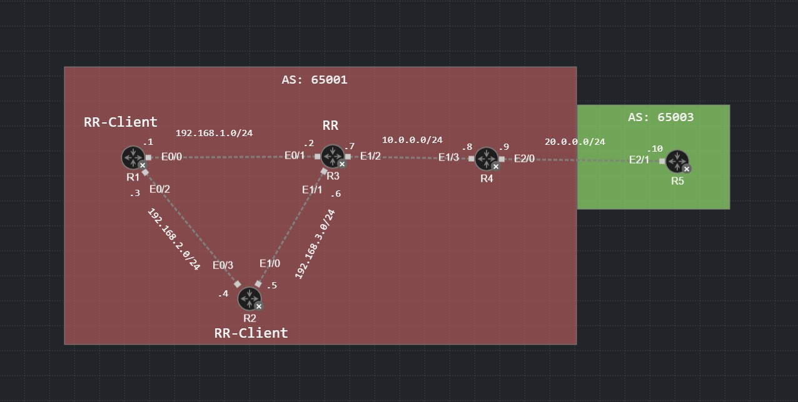
endif::[]

NOTE: All routers have already been configured with IP addresses on the appropriate interfaces.

'''
=== Step 1: Enable OSPF on R1, R2, R3, and R4 in AS 65001

OSPF is going to act as the IGP for AS 65001 providing connectivity between the routers. This is important for BGP functionality,
as that relies on existing TCP connections between the routers. To enable OSPF the command would be:

* `Rx(config)#router ospf 1`

ifdef::env-github[]
++++

  

<h4 align="center"></h4>
++++
endif::[]

ifndef::env-github[]
[]
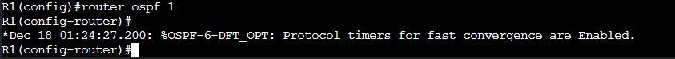
endif::[]

In order to establish OSPF adjacency between the routers the commands will be:

*R1:*

* `R1(config)#network 192.168.1.0 0.0.0.255 area 0`

ifdef::env-github[]
++++

  

<h4 align="center"></h4>
++++
endif::[]

ifndef::env-github[]
[]
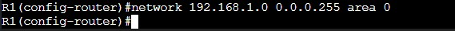
endif::[]

The `network` command is used by routing protocols to advertise the network to adjacent routers, but only if it is in the routing table.
OSPF will look for interfaces which fall under the specified range and advertise the network to adjacent routers. 
In the case of OSPF, this command defines the scope for which interfaces are in which area. 

* `R1(config)#network 192.168.2.0 0.0.0.255 area 0`

*R2:*

* `R2(config)#network 192.168.2.0 0.0.0.255 area 0`

ifdef::env-github[]
++++

  

<h4 align="center"></h4>
++++
endif::[]

ifndef::env-github[]
[]
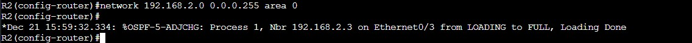
endif::[]

As you configure each adjacency you will see Syslog messages notifying you of the adjacency change from a Loading state to a Full state.
A Full state occurs when both adjacent routers have fully synchronized their Link-State Databases (LSDBs). 

* `R2(config)#network 192.168.3.0 0.0.0.255 area 0`

I am omitting the rest of the images for this section for brevity sake as there is no important information shown.

*R3:*

* `R3(config)#network 192.168.1.0 0.0.0.255 area 0`
* `R3(config)#network 192.168.3.0 0.0.0.255 area 0`
* `R3(config)#network 10.0.0.0 0.0.0.255 area 0`

*R4:*

* `R1(config)#network 10.0.0.0 0.0.0.255 area 0`

'''
=== Step 2: Verify OSPF Adjacencies and Connectivity

We can quickly verify that the routers are now configured with each other as adjacenies by using the `sh ip ospf rib` command.
This will show the OSPF router-id, as well as routes inside the RIB (Routing Information Base) which is a database for OSPF routes.
This also shows what routes are placed in the global IP route table and which ones are not.

* `R1(config)#sh ip ospf rib`

ifdef::env-github[]
++++

  

<h4 align="center"></h4>
++++
endif::[]

ifndef::env-github[]
[]
image::Pictures/OSPFRIB_R1.jpg[align=center]
endif::[]

We can tell that R1 has reachability for its neighbors as well as for the 10.0.0.0/24 network. We have full reachability within Area 0. 192.168.1.0/24 and 192.168.2.0/24 are not installed in the global RIB because
they are directly connected to R1.

'''
=== Step 3: Configure BGP for AS 65001 and AS 65003

Now we can configure BGP and the AS numbers to begin work on setting up the Route Reflectors. 
R1, R2, R3, and R4 will be in AS 65001 and you can configure the command:

* `Rx(config)#router bgp 65001`

For R5 the command would be:

* `R5(config)#router bgp 65003`

Now we'll configure the iBGP sessions for AS 65001. The commands will be:

*R1:*

* `R1(router-config)#neighbor 192.168.2.4 remote-as 65001`
* `R1(router-config)#neighbor 192.168.1.2 remote-as 65001`

*R2:*

* `R2(router-config)#neighbor 192.168.2.3 remote-as 65001`
* `R2(router-config)#neighbor 192.168.3.6 remote-as 65001`

ifdef::env-github[]
++++

  

<h4 align="center"></h4>
++++
endif::[]

ifndef::env-github[]
[]
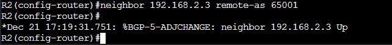
endif::[]

As the adjacencies start to form you will begin to see Syslog messages notifying you that the BGP adjaceny is now up. 

*R3:*

* `R3(router-config)#neighbor 192.168.1.1 remote-as 65001`
* `R3(router-config)#neighbor 192.168.3.5 remote-as 65001`
* `R3(router-config)#neighbor 10.0.0.8 remote-as 65001`

*R4:*

* `R4(router-config)#neighbor 10.0.0.7 remote-as 65001`

Now we'll configure the eBGP session between R4 and R5. The command will be:

*R4:*

* `R4(router-config)#neighbor 20.0.0.10 remote-as 65003`

*R5:*

* `R5(router-config)#neighbor 20.0.0.9 remote-as 65001`

'''
=== Step 4:Verify the BGP Adjacencies

We can easily verify whether BGP peering has been established on neighboring routers with the following command:

* `R3#sh ip bgp summ`

ifdef::env-github[]
++++

  

<h4 align="center"></h4>
++++
endif::[]

ifndef::env-github[]
[]
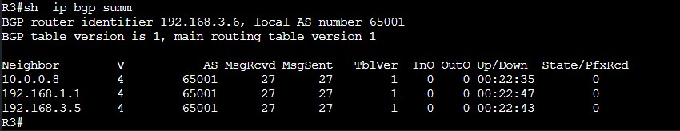
endif::[]

We can also verify BGP adjacency using another show command. A more complex command for verifying neighboring adjacencies is:

* `R1#sh ip bgp | i BGP neigh|BGP state`

ifdef::env-github[]
++++

  

<h4 align="center"></h4>
++++
endif::[]

ifndef::env-github[]
[]
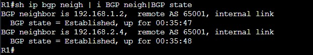
endif::[]

This show command piped with a regex statement for displaying the BGP neighbors and their current state can be used at a glance.
This command should display the neighbor's router-id, the AS it is in, and the state as "Established".

Another command that can be used is the `sh ip bgp` command. This will only work if BGP is advertising prefixes across the network.

To get some routes flowing between ASes I will redistribute OSPF into BGP. Using the "default" command with no modifiers, `redistribute ospf 1`, will cause only OSPF inter-area and intra-area routes
to be redistributed into BGP. In our case this means that R5 in AS 65003 will learn routes to all routers in AS 65001 because they are all in the same OSPF area. However, if there
were OSPF external routes, those would not be redistributed into BGP without extra command modifiers. Let's redistributed some routes:

* `R5(config)#router bgp 65001`
* `R5(config-router)#redistribute ospf 1`

ifdef::env-github[]
++++

  

<h4 align="center"></h4>
++++
endif::[]

ifndef::env-github[]
[]
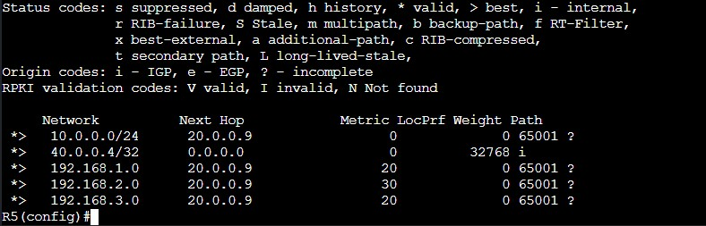
endif::[]

Now let's check the BGP table on R4 to see if the routes were redistributed. We're going to ignore the potential prolems this can cause within AS 65001 such as routing loops, blackholes, and lost attributes.
All we care about now is that AS 65003 has reachable routes via eBGP. I've also set a loopback address on R5 and advertised it into BGP so that AS 65001 has a route learned from AS 65003.

'''
=== Step 5: Setting Up the Route Reflector

Finally, you've reached the important part of this lab. I probably could have left the OSPF and BGP configuration out and just skipped to this part. As mentioned the point of a 
Route Reflector is to reflect routes learned via eBGP to Route Reflector Clients in order to remove the necessity for full mesh iBGP peering with eBGP border routers. 

In order to configure the RR you must actually configure the client from the router you want to become the RR. Since R3 will be the RR we'll start there:

* `R3(config)#router bgp 65001`
* `R3(config-router)#neighbor 192.168.1.1 route-reflector client`
* `R3(config-router)#neighbor 192.168.3.5 route-reflector client`

ifdef::env-github[]
++++

  

<h4 align="center"></h4>
++++
endif::[]

ifndef::env-github[]
[]
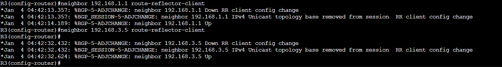
endif::[]

Both R1 and R2 are now configured as Route Reflector Clients while R3 is considered the Route Reflector itself. While the following images shows the neighbor connection
to R4 we can rule it out as not being a client because it is not followed by "Route-Reflector Client".

* `R3(config)#sh ip bgp neigh | i ID|Route-Reflector Client`

ifdef::env-github[]
++++

  

<h4 align="center"></h4>
++++
endif::[]

ifndef::env-github[]
[]
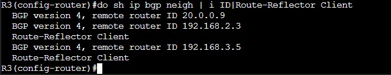
endif::[]

Now you may think that the job here is finished, but you must remember that reflected routes' NEXT_HOP attribute remains unchanged. That is why R1 and R2 still do not have the 40.0.0.4/32 prefix in their BGP table.

ifdef::env-github[]
++++

  

<h4 align="center"></h4>
++++
endif::[]

ifndef::env-github[]
[]
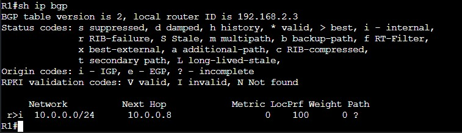
endif::[]

In order to fix this we can perform the following command:

* `R4(config)#router bgp 65001`
* `R4(config-router)#neighbor 10.0.0.7 next-hop-self`

ifdef::env-github[]
++++

  

<h4 align="center"></h4>
++++
endif::[]

ifndef::env-github[]
[]
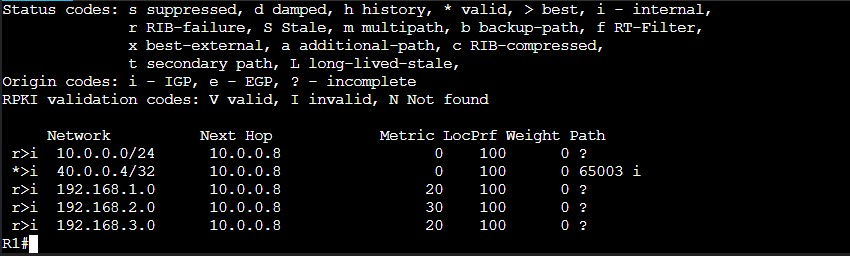
endif::[]

Now, back on R1 we can see that there is a route towards 40.0.0.4/32 with a next-hop of 10.0.0.8. Again, ignore the OSPF routes, I will address how to prevent that in a subsequent posting.
Since R3 now knows how to reach 40.0.0.4/32 because the NEXT_HOP attribute was changed to 10.0.0.8 instead of 20.0.0.10, R3 places 40.0.0.4/32 as a best path in the routing table.
Because 40.0.0.4/32 is now a best path, R3 will reflect the route to it's clients. 

This concludes the lab.

