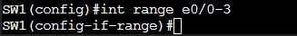
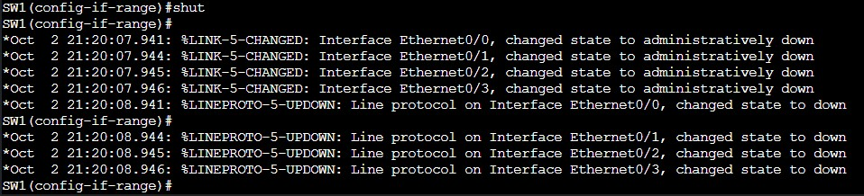

= EtherChannel Lab Introduction

This lab is taken from the CCIE Enterprise Infrastructure Foundation, 2nd Edition book by Narbik Kocharians. All credit is given to him and generally the following explanations in this lab guide.
His companion/walkthrough article to go alongside the Cisco Press book is quite detailed and provides detailed insight into certain design choices and how the protocols operate.
This lab guide is mainly a regurgitation of the steps I followed and what I have learned from the reading and configuration. This is in no way my own work. 

== What is EtherChannel

EtherChannel is a Cisco proprietary technology designed to negotiate the creation/encapsulation of LAGs between switches using PAgP or LACP. This enables switches to load-balance traffic as well
as remove any blocking links created by STP. When both interfaces (called a port-channel on the local switch) are bundled into a channel-group (the actual grouping of both port-channels), they
appear as a single logical interface on each switch to STP. This also makes configuration of the port-channel and channel-group easier on the network engineer. For a in-depth look into EtherChannel
please visit my other article here

<add hyperlink>.

When not using EtherChannel to bundle links together STP will block links between switches that are capable of forming a loop. In the case of two links between switches, one interface will be blocking
essentially halving the bandwidth. Configuring EtherChannel will allow STP to view both the links as a single physical link and not block one of the links. By bundling these links it also enables the switch to
load balance traffic across them. This increases the available bandwidth when multiple independant sessions are communicating between the switches. 

Now lets dive into the lab

== Topology

The following is a look at the topology that will be used for this lab. I am using Cisco Modeling Labs Free to complete this lab.

ifdef::env-github[]
++++

  

<h4 align="center">Figure 1. EtherChannel EIF Lab Toplogy</h4>
++++
endif::[]

ifndef::env-github[]
[]
image::Pictures/LabTopology.jpg[align=center]
endif::[]

=== Step 1: Shut down all ports on all switches and configure the VTP domain "TST"

First, by shutting down all ports this limits the risk of a "VTP Bomb". VTP works by synchronizing the VTP server's VLAN DB to all VTP Client switches. All switches must have the same VTP domain to operate and sync their VLAN DB's together.
However, the critical feature of VTP to enable all switches to have the same VLAN DB is the revision number of the server. The higher the revision number the more "accurate" that VLAN DB is or supposedly is.
One key thing to remeber is that if you introduce an old switch into the network and configure the same VTP domain and it is configured as a server, it may have a higher revision number. THis can cause this old switch
to replace all the other switch's VLAN DB's with incorrect VLAN information. This could destroy network connectivity and result in very angry end users all in one fell swoop. 

To shut down all ports you can use the interface range command to configure multiple interfaces at the same time. For example on SW1 the command would be:

* `SW1(config)#int range e0/0-3`

ifdef::env-github[]
++++

  

++++
endif::[]

ifndef::env-github[]
[]

endif::[]

* `SW1(config-if-range)#shut`

ifdef::env-github[]
++++

  

++++
endif::[]

ifndef::env-github[]
[]

endif::[]

To verify that all the interfaces are shut down the following command can be performed:

* `SW1#sh ip int br`

ifdef::env-github[]
++++

  

++++
endif::[]

ifndef::env-github[]
[]

endif::[]

[.text-center]
In order to determine if you have shut down all the interfaces on the device, this command can be referenced. In the case of the interface being down or not, first refer to
the lefthand side where the interface name is. Then to the right of it you will see the Protocol status and the Status status. The Protocol refers to Layer 2 and Status refers to Layer 1.
This makes it easy for network engineers to identify is the problem is being caused by a faulty cable or misconfiguration on the interface. The word "Administratively down" means that
the command `shut` was performed on the interface to disable it.
 
All VTP domains must match for the VLAN DB to be propogated from the server to the clients. The command would be:

* `SW1(config)#vtp domain TST`

ifdef::env-github[]
++++

  

++++
endif::[]

ifndef::env-github[]
[]

endif::[]

By default the VTP domain is set to null. Once added to the VTP domain the switch generates a Syslog message and sends a VTP messages to other switches to see if they are in the same VTP domain. 

To verify the VTP configuration on the switch the following command can be performed:

* `SW1#sh vtp status`

ifdef::env-github[]
++++

  

++++
endif::[]

ifndef::env-github[]
[]

endif::[]

This command will show you the VTP Version that is running on the switch. In this case it is version 1. Just under that is the VTP Domain name. Remember that in order for switches to receive VTP Update messages
and the VLAN DB, they must be in the same VTP domain. The VTP Operating Mode show the VTP Mode of the switch. In this case it is a client and it receives VTP updates, but is not capable of adding/changing VLANs in the domain.

Step 1 should be done on all switches in the topology.

=== Step 2: Configure e0/3 and e0/2 between SW2 and SW3 as trunk links using an industry standard protocol.  SW2 ports should be configured to only respond to PAgP packets and never start the negotiation process.

It is important that both sides of the channel-group have the same configuration. The same trunk mode, encapsulation, speed, and duplex settings must all match between all the interfaces. This ensures that flapping or loops will not occur.
If one side is not consistent with the other, then no Etherchannel will be formed and the links will operate independantly. 

Starting on Switch 2 first ensure that the interfaces are in the default state with no configuration. This can be done with the following command:

* `SW2(config)#default int range e0/2-3`

ifdef::env-github[]
++++

  

++++
endif::[]

ifndef::env-github[]
[]

endif::[]

Then bring up the e0/2-3 interfaces with the following sequence:

* `SW2(config)#int range e0/2-3`
* `SW2(config-if-range)#no shut`

ifdef::env-github[]
++++

  

++++
endif::[]

ifndef::env-github[]
[]

endif::[]

Configure the Etherchannel and create the port-channel all in the same command:

* `SW2(config-if-range)#channel-group 23 mode auto`

ifdef::env-github[]
++++

  

++++
endif::[]

ifndef::env-github[]
[]

endif::[]

According to the instructions SW2 is supposed to only response to PAgP packets and not start the negotiation process. The keyword "auto" denotes using PAgP negotiation and ports
configured in auto mode never send out Etherchannel negotiation packets. It will only configure a trunk link if it receives a negotiation packet. The number "23" refers to ID number for the channel-group.

Next, the encapsulation protocol of the trunk link should be set. As per the instructions we should use an industry standard protocol, thus IEEE 802.1Q.
This can be performed by entering the port-channel configuration mode with the following sequence:

* `SW2(config)#int port-channel 23`
* `SW2(config-if)#switchport trunk encapsulation dot1q`
* `SW2(config)#switchport mode trunk`

ifdef::env-github[]
++++

  

++++
endif::[]

ifndef::env-github[]
[]

endif::[]

These commands will set the trunk encapsulation to use 802.1Q and statically define the interface as a trunk.

Next Switch 3 will generally be configured with the same commands, an exception being the channel-group ID and the PAgP mode. This time the PAgP mode is set to desirable to facilitate the initation of an Etherchannel.
The following commands should be performed on Switch 3:

* `SW3(config)#default int range e0/2-3`

ifdef::env-github[]
++++

  

++++
endif::[]

ifndef::env-github[]
[]

endif::[]

* `SW3(config)#int range e0/2-3`
* `SW3(config-if-range)#no shut`

ifdef::env-github[]
++++

  

++++
endif::[]

ifndef::env-github[]
[]

endif::[]

* `SW3(config-if-range)#channel-group 32 mode desirable`

ifdef::env-github[]
++++

  

++++
endif::[]

ifndef::env-github[]
[]

endif::[]

* `SW3(config)#int port-channel 32`
* `SW3(config-if)#switchport trunk encapsulation dot1q`
* `SW3(config-if)#switchport mode trunk` 

ifdef::env-github[]
++++

  

++++
endif::[]

ifndef::env-github[]
[]

endif::[]

=== Step 3: Configure e1/0, e1/1 and e0/0, e0/1 on SW2 and SW4 respectively. Set as trunk using industry standard protocol. These interfaces should not negotiate an Etherchannel via PAgP or LACP.

The following indstructions refer us to not use a negotiation method for the creation of the Etherchannel. We can assume the only other logical method of Etherchannel
creation is using the "on" mode. This can be used on devices who do not support negotiation protocols. Keep in mind the configuration on both switches must match in terms of speed, duplex, trunking mode,
and encapsulation for the Etherchannel to be created and operational.

Just like the previous configuration it will mostly be the same, an exception being the channel-group ID and negotiation mode.
The following commands should be performed on SW2:

* `SW2(config)#default int range e1/0-1`

ifdef::env-github[]
++++

  

++++
endif::[]

ifndef::env-github[]
[]

endif::[]

* `SW2(config)#int range e1/0-1`
* `SW2(config)#no shut`

ifdef::env-github[]
++++

  

++++
endif::[]

ifndef::env-github[]
[]

endif::[]

* `SW2(config-if-range)#channel-group 24 mode on`

ifdef::env-github[]
++++

  

++++
endif::[]

ifndef::env-github[]
[]

endif::[]

* `SW2(config)#int port-channel 24`
* `SW2(config-if)#switchport trunk encapsualtion dot1q`
* `SW2(config-if)#switchport mode trunk`

ifdef::env-github[]
++++

  

++++
endif::[]

ifndef::env-github[]
[]

endif::[]

Likewise the following commands can be made on SW4, again there being exceptions:

* `SW4(config)#default int range e0/0-1`

ifdef::env-github[]
++++

  

++++
endif::[]

ifndef::env-github[]
[]

endif::[]

* `SW4(config)#int range e0/0-1`

ifdef::env-github[]
++++

  

++++
endif::[]

ifndef::env-github[]
[]

endif::[]

* `SW4(config-if-range)#channel-group 42 mode on`

ifdef::env-github[]
++++

  

++++
endif::[]

ifndef::env-github[]
[]

endif::[]

* `SW4(config)#int port-channel 42`
* `SW4(config-if)#switchport trunk encapsualtion dot1q`
* `SW4(config-if)#switchport mode trunk`

ifdef::env-github[]
++++

  

++++
endif::[]

ifndef::env-github[]
[]

endif::[]

=== Step 4: Ensure that all Etherchannels on SW2 are load-balanced based on the destiation MAC address

Etherchannels can load-balance traffic from different flows across all links depending on the load-balancing option configured on the switch. By default it is confiuged for the source MAC address.
This is not configured on the port-channel level. 

The following command can be configued on SW2 to set the load-balancing method:

* `SW2(config)#port-channel load-balance dst-mac`

ifdef::env-github[]
++++

  

++++
endif::[]

ifndef::env-github[]
[]

endif::[]

=== Step 5: Configure e1/0-1 and e1/2-3 on SW4 and SW3 respectively as a single Layer 3 link. Confdigure SW3 with the IP address 34.1.1.3/24
and SW4 with the IP address 34.1.1.4/24. These interfaces should not negotiate LACP or PAgP.

A Layer 3 Etherchannel has multiple uses including router-to-router LAGs for redundancy, increased bandwidth utilization purposes, and simplifying the routing table.

A Layer 3 Etherchannel must first be defined by the interface port-channel command, then enabled for LAyer 3 with the `no switchport` command. This is unlike a
Layer 2 Etherchannel where the port-channel interface is automatically created when the channel-group command is used.

IMPORTANT: You must perform `no switchport` on the physical interfaces as well as in the port-channel interface mode.

The following command sequence can be performed on SW3:

* `SW3(config)#default int range e1/2-3`

ifdef::env-github[]
++++

  

++++
endif::[]

ifndef::env-github[]
[]

endif::[]

* `SW3(config)#int port-channel 34`

ifdef::env-github[]
++++

  

++++
endif::[]

ifndef::env-github[]
[]

endif::[]

* `SW3(config)#no switchport`

ifdef::env-github[]
++++

  

++++
endif::[]

ifndef::env-github[]
[]

endif::[]

This `no switchport` command makes the port-channel Layer 3.

* `SW3(config-if)#ip addr 34.1.1.3 255.255.255.0`

ifdef::env-github[]
++++

  

++++
endif::[]

ifndef::env-github[]
[]

endif::[]

* `SW3(config)#int range e1/2-3`
* `SW3(config-if)#no switchport`

ifdef::env-github[]
++++

  

++++
endif::[]

ifndef::env-github[]
[]

endif::[]

This `no switchport` command makes the physical interfaces Layer 3. 

* `SW3(config-if)#channel-group 34 mode on`

ifdef::env-github[]
++++

  

++++
endif::[]

ifndef::env-github[]
[]

endif::[]

* `SW3(config)#int range e1/2-3`
* `SW3(config)#shut`
* `SW3(config)#no shut`

ifdef::env-github[]
++++

  

++++
endif::[]

ifndef::env-github[]
[]

endif::[]

The same commands can be performed on SW4 with the exception of the channel-group ID being 43 and the IP address being 34.1.1.4/24.

* `SW4(config)#default int range e1/0-1`

ifdef::env-github[]
++++

  

++++
endif::[]

ifndef::env-github[]
[]

endif::[]

* `SW4(config)#int port-channel 43`

ifdef::env-github[]
++++

  

++++
endif::[]

ifndef::env-github[]
[]

endif::[]

* `SW4(config)#no switchport`

ifdef::env-github[]
++++

  

++++
endif::[]

ifndef::env-github[]
[]

endif::[]

* `SW4(config-if)#ip addr 34.1.1.4 255.255.255.0`

ifdef::env-github[]
++++

  

++++
endif::[]

ifndef::env-github[]
[]

endif::[]

* `SW4(config)#int range e1/0-1`
* `SW4(config-if)#no switchport`

ifdef::env-github[]
++++

  

++++
endif::[]

ifndef::env-github[]
[]

endif::[]

* `SW4(config-if)#channel-group 42 mode on`

ifdef::env-github[]
++++

  

++++
endif::[]

ifndef::env-github[]
[]

endif::[]

* `SW4(config)#int range e1/0-1`
* `SW4(config)#shut`
* `SW4(config)#no shut`

ifdef::env-github[]
++++

  

++++
endif::[]

ifndef::env-github[]
[]
image::Pictures/5NoShutSW4.jpg[align=left]
endif::[]

This concludes the lab.

